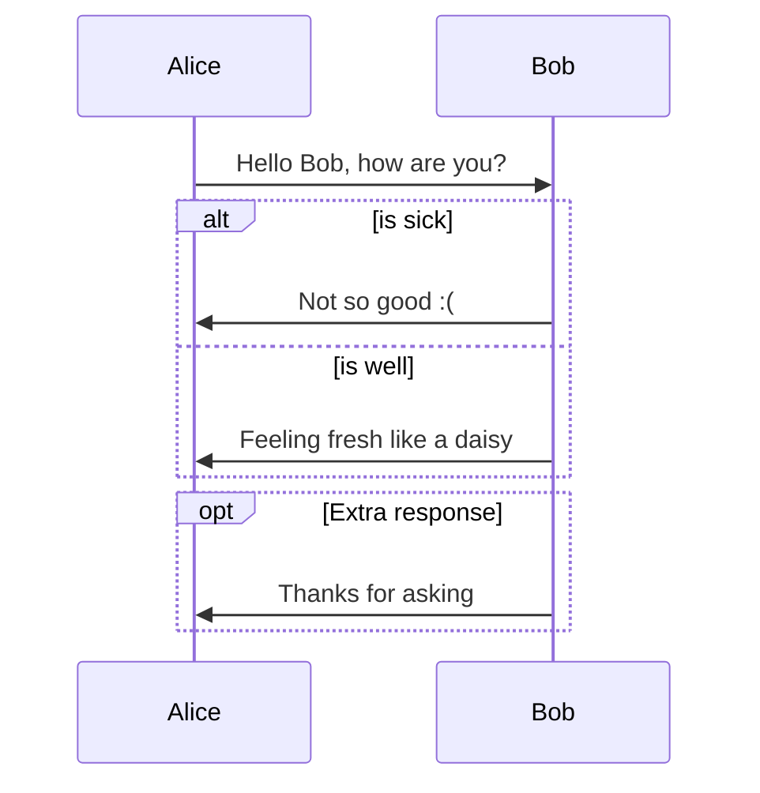

## 一、Java

### 1.1 Java8通关攻略

[Java8通关攻略](https://juejin.im/post/5e1d665bf265da3e4608fa17?utm_source=gold_browser_extension	"Java8通关攻略")


## 二、Markdown

### 2.1 画图

[Draw-Diagrams-With-Markdown](http://support.typora.io/Draw-Diagrams-With-Markdown/ "Draw-Diagrams-With-Markdown")


```flow
st=>start: Start
op=>operation: Your Operation
cond=>condition: Yes or No?
e=>end

st->op->cond
cond(yes)->e
cond(no)->op
```


```sequence
Andrew->China: Says Hello
Note right of China: China thinks\nabout it
China-->Andrew: How are you?
Andrew->>China: I am good thanks!
```

```sequenceDiagram
participant Alice
participant Bob
Alice->>John: Hello John, how are you?
loop Healthcheck
    John->>John: Fight against hypochondria
end
Note right of John: Rational thoughts <br/>prevail!
John-->>Alice: Great!
John->>Bob: How about you?
Bob-->>John: Jolly good!
```


```graph
  Alice->>John: Hello John, how are you?
    activate John
    John-->>Alice: Great!
    deactivate John
```

```sequenceDiagram
Alice->>John: Hello John, how are you?
activate John
John-->>Alice: Great!
deactivate John
```



